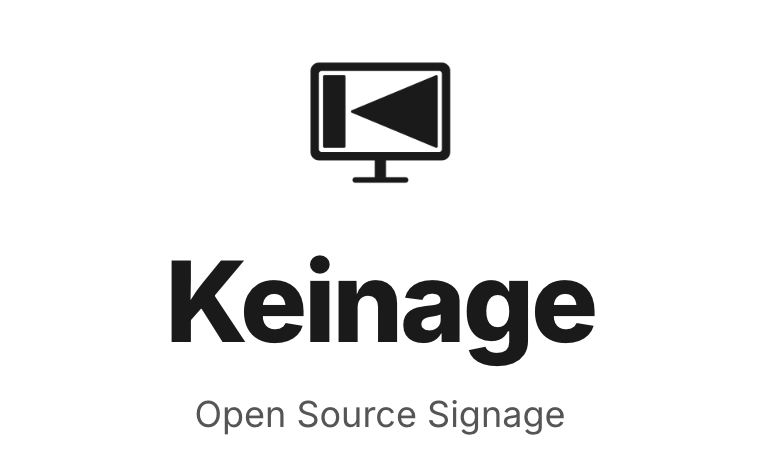
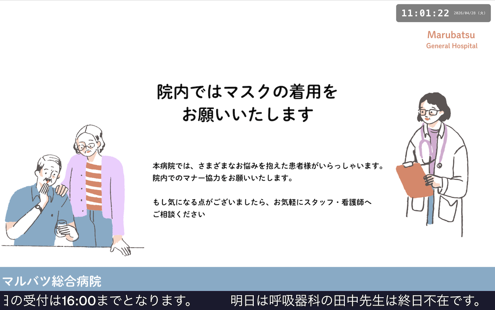
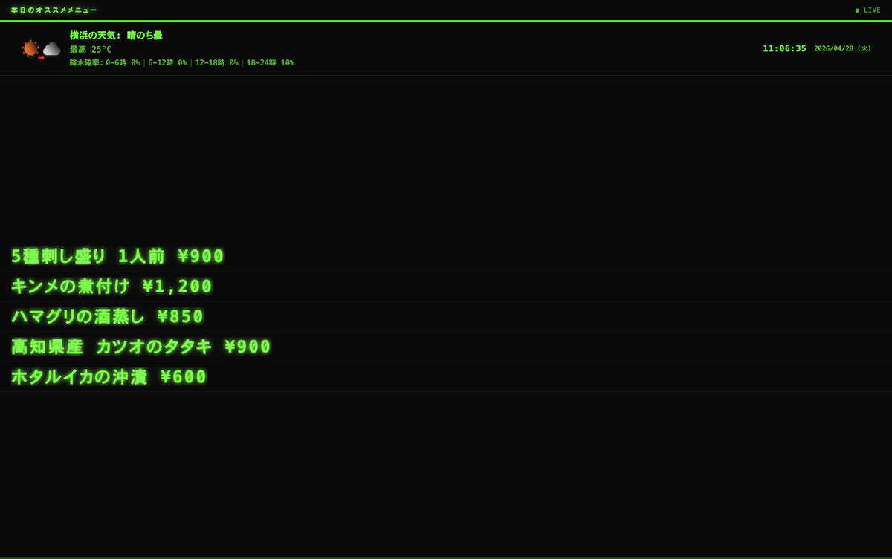
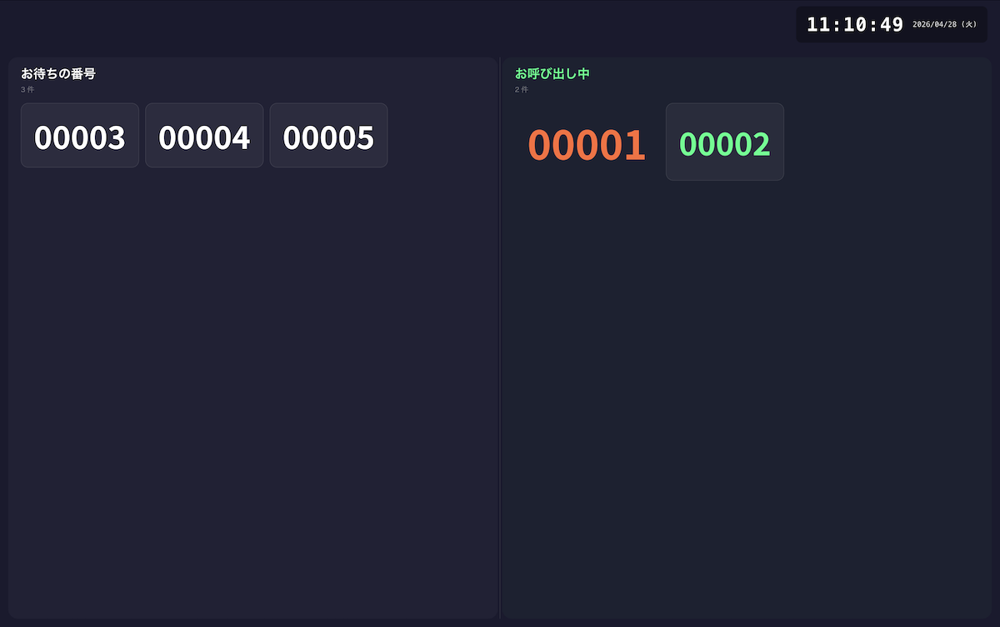

# Keinage

<p align="center">

<p>
<p align="center">
Web上で簡単にカスタマイズ可能な掲示板、案内板、デジタルサイネージ
</p>

## 特徴
病院の待合室、スーパーマーケット、飲食店など、あらゆる場所で情報を掲示するためのフリーツール (OSS) です。  
管理画面からコンテンツを登録するだけで、表示用の画面がリアルタイムに更新されます。

- **テンプレートベース** — 用途に合わせて複数のデザインテンプレートから選択可能
- **リアルタイム更新** — 管理画面や API からの変更が即座にボードへ反映
- **認証付き API** — Route Handler API を通じてボード、メディア、メッセージを操作可能
- **かんたんデプロイ** — Docker Compose でアプリと PostgreSQL をまとめて起動
- **フルカスタマイズ** — 色、フォント、表示速度などをボードごとに調整

---

## テンプレート

### シンプルな電子掲示板


メイン領域で画像や動画をスライドショー形式で表示し、テキストメッセージをティッカー (横スクロール) で流すデザインです。  
店舗のプロモーション表示や施設案内に最適です。

### フォトクロック掲示板


画像のスライドショーを全画面で表示しつつ、現在の日付と時刻を常時オーバーレイ表示するデザインです。  
オフィスのロビーやエントランス、ホテルのラウンジなどに最適です。

### レトロな掲示板


駅の案内板を模した、ドットマトリクス風のクラシックなデザインです。  
独特のレトロな雰囲気で、カフェやイベント会場などの掲示に映えます。

### 呼び出し番号


スマホなどから、呼び出し番号の追加と呼び出しを行えるテンプレートです。


---

## 技術スタック

| カテゴリ | 技術 |
|---------|------|
| 言語 | TypeScript |
| フレームワーク | Next.js 16 (App Router) |
| スタイリング | Tailwind CSS v4 |
| UI コンポーネント | shadcn/ui |
| アニメーション | Framer Motion |
| ORM / DB | Drizzle ORM + PostgreSQL |
| リアルタイム通信 | Server-Sent Events (SSE) |
| バリデーション | Zod |
| コンテナ | Docker |

詳しい情報は以下を参照してください。

- [docs/SPEC.md](docs/SPEC.md) — ユーザー視点の機能仕様
- [docs/DESIGN.md](docs/DESIGN.md) — メンテナー / 開発者向けの設計と実装構造
- [docs/API.md](docs/API.md) — 画面ルートと API Route Handler 一覧

---

## クイックスタート

### 必要環境

- **Node.js** 20 以上
- **pnpm** 9 以上
- (オプション) **Docker** & **Docker Compose**

### Docker Compose で起動

```bash
git clone https://github.com/HiroshiARAKI/Keinage.git
cp .env.example .env
cd Keinage
docker compose up -d
```

`.env`は適宜修正してください。
`docker compose up -d` でアプリ本体と PostgreSQL コンテナが同時に起動します。

Docker Compose の既定構成では、メディア保存先はローカル `uploads/` ディレクトリです。
必要に応じて、S3 互換のあるストレージサービスを利用できます。

```yaml
environment:
  - S3_ENDPOINT=http://rustfs:9000
  - S3_REGION=us-east-1
  - S3_BUCKET=keinage-media
  - S3_ACCESS_KEY_ID=rustfsadmin
  - S3_SECRET_ACCESS_KEY=rustfsadmin
  - S3_FORCE_PATH_STYLE=true
```

`docker-compose.yml` には rustfs のコメント例を残していますが、alpha 版のため既定では起動しません。

### RustFS に切り替える最短手順

1. `docker-compose.yml` の `rustfs` サービスコメントを外す
2. `.env` で次を有効化する
  `S3_INTERNAL_ENDPOINT=http://rustfs:9000`
  `S3_REGION=us-east-1`
  `S3_BUCKET=keinage-media`
  `S3_ACCESS_KEY_ID=rustfsadmin`
  `S3_SECRET_ACCESS_KEY=rustfsadmin`
  `S3_FORCE_PATH_STYLE=true`
3. `docker compose up -d db rustfs app` を実行する
4. RustFS の Web UI (`http://127.0.0.1:9001/`) で `keinage-media` バケットを作成する

この状態で app は自動的にローカル `uploads/` ではなく RustFS に保存します。Docker Compose 内の app は `S3_INTERNAL_ENDPOINT` を優先して使うため、`127.0.0.1` ではなく `rustfs:9000` へ接続されます。`S3_ACCESS_KEY_ID` と `S3_SECRET_ACCESS_KEY` は、rustfs 側の `RUSTFS_ACCESS_KEY` / `RUSTFS_SECRET_KEY` と同じ値を使ってください。

ブラウザで http://localhost:3000 にアクセスし、初回は Owner 管理者アカウントを登録してください。
メールアドレス + パスワード、または Google アカウントで登録できます。登録後はそのまま 6 桁 PIN を設定します。

#### SMTP 設定 (任意)

Owner 登録リンク、Shared ユーザー招待リンク、PIN リセットリンクをメール送信したい場合は、公開 URL と SMTP を設定してください。`APP_PUBLIC_ORIGIN` はブラウザで開く origin と一致させてください。ローカル開発では `http://localhost:3000` を使い、bind address の `http://0.0.0.0:3000` は設定しないでください。

```yaml
environment:
  - APP_PUBLIC_ORIGIN=https://keinage.example.com
  - SMTP_HOST=smtp.example.com
  - SMTP_PORT=587
  - SMTP_USER=noreply@example.com
  - SMTP_PASS=your-password-here
  - SMTP_FROM=noreply@example.com
```

> **Note:** SMTP 未設定時、未認証の Owner signup / PIN reset メールフローは既定で無効です。
> ローカル開発で signup 直リンクのプレビューを使う場合だけ、`.env` に `ALLOW_UNAUTHENTICATED_SIGNUP_PREVIEW=true` を設定し、`APP_PUBLIC_ORIGIN` を `http://localhost:3000` のような localhost origin にしてください。

#### Google OAuth/OIDC 設定 (任意)

Google アカウントによる Owner 登録、Shared ユーザー登録、ログインを有効にする場合は、Google Cloud Console の OAuth クライアントに次の Redirect URI を登録してください。

```text
${APP_PUBLIC_ORIGIN}/api/auth/google/callback
```

ローカル開発では、Google Cloud Console 側にも `http://localhost:3000/api/auth/google/callback` を登録してください。`APP_PUBLIC_ORIGIN` や Redirect URI に `0.0.0.0` を使うと、ブラウザが state Cookie を callback に送れず `invalid-google-state` になります。

Docker Compose では `.env` に次を設定します。

```bash
GOOGLE_OAUTH_ENABLED=true
GOOGLE_OAUTH_CLIENT_ID=your-client-id.apps.googleusercontent.com
GOOGLE_OAUTH_CLIENT_SECRET=your-client-secret
```

内部実装は Google を OIDC Provider preset として扱い、`https://accounts.google.com/.well-known/openid-configuration` の Discovery から authorization / token / userinfo / JWKS endpoint を取得します。環境変数名は既存設定との互換性のため `GOOGLE_OAUTH_*` のままです。

Google 認証で作成したユーザーは Google 認証専用、メールアドレス + パスワードで作成したユーザーはパスワード認証専用です。作成後に認証方式は変更できません。

```bash
# 停止
docker compose down

# 停止 + データ削除
docker compose down -v
```

> **Note:** データ (PostgreSQL DB、アップロードファイル) は Docker ボリュームに永続化されます。`docker compose down` ではデータは保持され、`-v` オプションを付けるとボリュームごと削除されます。

## ドキュメント

- [docs/SPEC.md](docs/SPEC.md) — ユーザーアカウント、認証、ボード編集、設定などの機能仕様
- [docs/DESIGN.md](docs/DESIGN.md) — mermaid 図を含む全体設計、Database schema、技術要素、ディレクトリ構成
- [docs/API.md](docs/API.md) — 画面ルート、API Route Handler、SSE、アップロード配信 route の一覧

## コントリビューション

Issue や Pull Request は歓迎します。  
バグ報告や機能リクエストは GitHub Issues よりお願いいたします。

---

## 謝辞

- 天気予報データは [天気予報 API（livedoor 天気互換）](https://weather.tsukumijima.net/) を利用させていただいています。

---

## ライセンス

このプロジェクトは [Apache License 2.0](LICENSE) の下でライセンスされています。
個人利用、社内利用、商用利用、オンプレミス環境でのセルフホスト利用は、
Apache License 2.0 の条件に従って自由に行えます。

ただし、Keinage の名称、ロゴ、公式サービスと誤認されるブランド表現は
Apache License 2.0 の許諾対象ではありません。

詳しくは [LICENSE](LICENSE), [NOTICE](NOTICE) および [TRADEMARK.md](docs/TRADEMARK.md)ファイルをご参照ください。
