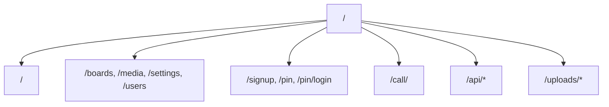
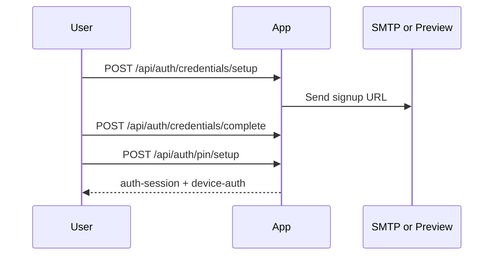
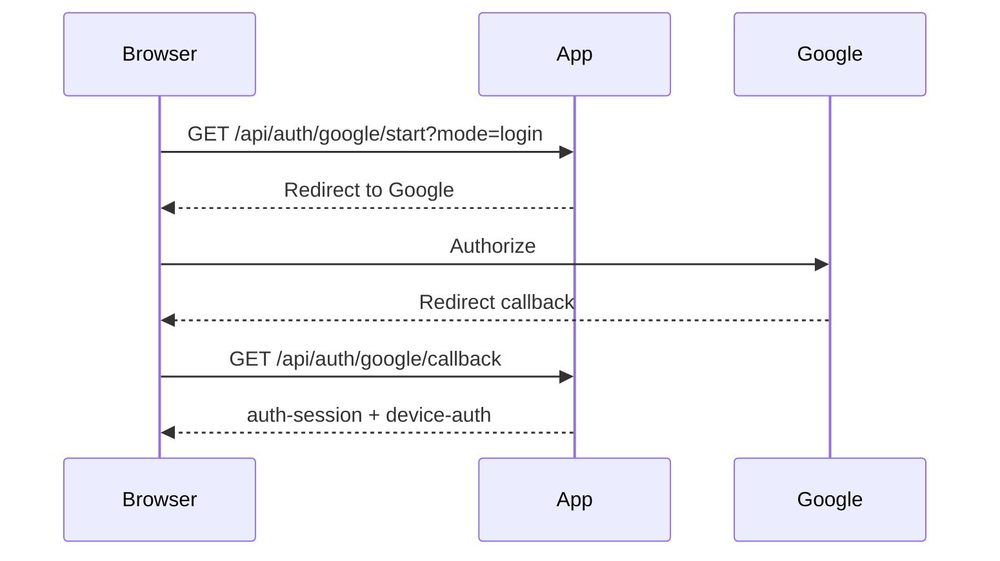
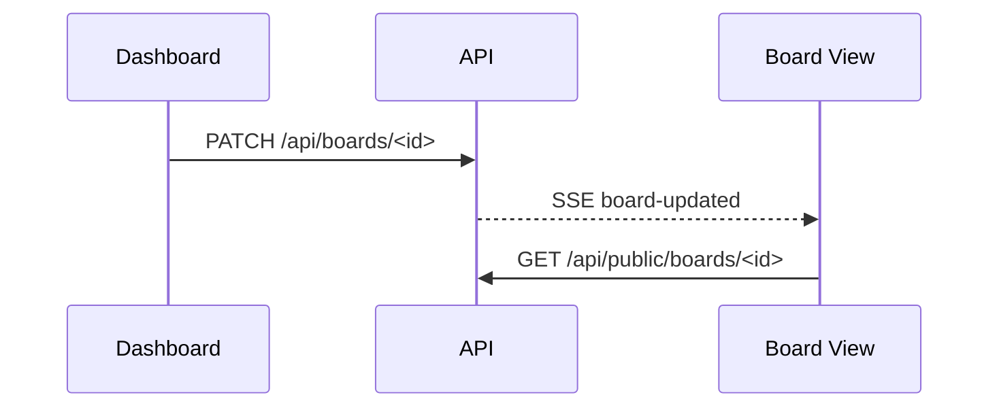

# Keinage Routing Reference

最終更新: 2026-04-30

## 1. このドキュメントの目的

このドキュメントは Keinage の画面ルートと API Route Handler を一覧できるようにまとめます。詳細な利用者向け仕様は [SPEC.md](./SPEC.md)、内部設計は [DESIGN.md](./DESIGN.md) を参照してください。

## 2. ルーティング全体

## 3. 画面ルート

### 3.1 公開・表示画面

| Path | 内容 | 認証 |
| --- | --- | --- |
| `/` | 初期導線。状態に応じてボード/ダッシュボード/認証へ誘導 | 状況による |
| `/<boardId>` | 公開ボード表示 | 不要 |
| `/call/<boardId>` | 呼び出し番号テンプレート用の操作画面 | ボードの call passcode |

### 3.2 ダッシュボード

| Path | 内容 | 認証 |
| --- | --- | --- |
| `/boards` | ボード一覧 | 必要 |
| `/boards/new` | ボード作成 | 必要 |
| `/boards/<boardId>` | ボード編集 | 必要 |
| `/media` | アップロード済みメディア管理 | `admin` |
| `/billing` | プランとお支払い管理 | `admin` / Billing 有効時 |
| `/settings` | ユーザー設定・管理設定 | 必要 |
| `/users` | Shared user 管理 | `admin` |
| `/delete-account` | Owner アカウント削除リクエスト | Owner / `admin` |

### 3.3 認証・登録

| Path | 内容 | 認証 |
| --- | --- | --- |
| `/signup` | Owner 登録開始 | 不要 |
| `/signingup` | Owner 登録 URL の送達待ち | `signup-request-id` Cookie |
| `/signup/<token>` | Owner パスワード設定 | 登録 token |
| `/signup/shared?token=<token>` | Shared user 登録 | 招待 token |
| `/pin/setup` | 初期 PIN 設定 | 一時セットアップセッション |
| `/pin` | PIN ログイン | `device-auth` Cookie |
| `/pin/login` | フル認証ログイン | 不要 |
| `/pin/forgot` | PIN リセット依頼 | 不要 |
| `/pin/reset/<token>` | PIN リセット | リセット token |
| `/deleting-account/<token>` | アカウント削除確定 | 削除 token |
| `/deleted-account` | アカウント削除完了 | 不要 |

## 4. Cookie

| Cookie | 用途 |
| --- | --- |
| `auth-session` | 認証済みセッション |
| `device-auth` | 端末単位のフル認証履歴 |
| `signup-request-id` | `/signingup` 用の Owner 仮登録識別 |
| `google-oauth-state` | Google OAuth/OIDC callback の state 検証 |

`NODE_ENV=production` では認証系 Cookie に `Secure` 属性が付きます。ローカル開発では HTTP 動作のため `Secure` を付与しません。

## 5. 認証 API

### 5.1 Owner / Shared 登録

| Method | Path | 内容 | 認証 |
| --- | --- | --- | --- |
| `POST` | `/api/auth/credentials/setup` | Owner 仮登録を作成し、登録 URL を発行 | 不要 |
| `POST` | `/api/auth/credentials/setup/resend` | Owner 登録 URL を再送・再発行 | `signup-request-id` Cookie |
| `POST` | `/api/auth/credentials/complete` | Owner のパスワード登録を完了 | 登録 token |
| `POST` | `/api/auth/credentials/shared/complete` | Shared user のパスワード登録を完了 | 招待 token |
| `GET` | `/api/auth/google/start` | Google OAuth/OIDC を開始して Google へ redirect | 不要 |
| `POST` | `/api/auth/google/start` | Google OAuth/OIDC 認可 URL を JSON で返す | 不要 |
| `GET` | `/api/auth/google/callback` | Google callback を処理し、登録またはログインを完了 | state Cookie |
| `POST` | `/api/auth/pin/setup` | 初期 PIN を設定 | 一時セットアップセッション |

`GET /api/auth/google/start` は `mode=login|owner-signup|shared-signup`、`redirectTo`、`token` を受け付けます。Google OAuth/OIDC は Authorization Code + PKCE、nonce、opaque state、JWKS 署名検証を使います。

### 5.2 ログイン・ログアウト

| Method | Path | 内容 | 認証 |
| --- | --- | --- | --- |
| `POST` | `/api/auth/credentials/login` | メールアドレスまたはユーザーID + パスワードでログイン | 不要 |
| `POST` | `/api/auth/pin/verify` | PIN ログイン | `device-auth` Cookie |
| `POST` | `/api/auth/pin/logout` | 現在のセッションを削除 | 任意 |
| `GET` | `/api/auth/pin/status` | PIN ログイン対象ユーザーと期限情報を取得 | 任意 |

`POST /api/auth/credentials/login` と `POST /api/auth/pin/verify` は失敗回数制限を行います。`TRUST_PROXY_HEADERS=true` のときだけ `x-forwarded-for` / `x-real-ip` を client IP として信用します。

### 5.3 アカウント設定

| Method | Path | 内容 | 認証 |
| --- | --- | --- | --- |
| `PATCH` | `/api/auth/password/change` | パスワード変更 | 必要 |
| `PATCH` | `/api/auth/pin/change` | PIN 変更 | 必要 |
| `POST` | `/api/auth/pin/forgot` | PIN リセット URL を送信 | 不要 |
| `POST` | `/api/auth/pin/reset` | PIN リセット token で PIN を更新 | リセット token |
| `POST` | `/api/auth/account-deletion/request` | Owner アカウント削除 URL を送信 | Owner / `admin` |
| `POST` | `/api/auth/account-deletion/complete` | Owner アカウント削除を確定。Stripe有効時はサブスクリプションを即時キャンセルしてから削除 | 削除 token |
| `PATCH` | `/api/users/me` | 自分の表示テーマ・locale を更新 | 必要 |
| `POST` | `/api/contact` | 問い合わせメール送信 | 必要 |

`/contact` は plan に応じて導線を出し分けます。Self-hosted / unlimited は GitHub Issues / Discussions、Free は Upgrade 推奨 + GitHub Issues、Lite / Standard / Standard+ は SMTP 設定がある場合に問い合わせフォームを表示します。フォーム送信時の Owner 情報、送信ユーザー、現在の plan は server-side session から付与され、hidden input には持たせません。問い合わせ専用 SMTP は `CONTACT_SMTP_HOST`、`CONTACT_SMTP_PORT`、`CONTACT_SMTP_USER`、`CONTACT_SMTP_PASS`、`CONTACT_SMTP_FROM`、`CONTACT_TO_EMAIL` で設定します。未設定時は GitHub への fallback を表示します。送信 API は Owner + IP 単位で 1 時間 3 件までの rate limit を適用します。

## 6. ボード API

| Method | Path | 内容 | 認証 |
| --- | --- | --- | --- |
| `GET` | `/api/boards` | 自分が編集できるボード一覧 | 必要 |
| `POST` | `/api/boards` | ボード作成 | 必要 |
| `GET` | `/api/boards/<id>` | ボード詳細 | 必要 |
| `PATCH` | `/api/boards/<id>` | ボード設定更新 | 必要 |
| `DELETE` | `/api/boards/<id>` | ボード削除 | 必要 |
| `GET` | `/api/public/boards/<id>` | 公開ボード詳細 | 不要 |

`GET /api/public/boards/<id>` はボード表示に必要な `boardPlan.watermark` を返します。この値は Owner の effective plan からサーバー側で算出され、plan code や subscription 詳細は公開しません。ブラウザ表示上のウォーターマークであり、完全な削除・改ざん防止は保証しません。

Owner退会時、`BILLING_MODE=stripe` かつキャンセル可能な Stripe subscription がある場合は Stripe の即時キャンセルに成功してからOwner削除へ進みます。キャンセルに失敗した場合、アカウントとデータは削除されません。退会済みOwnerのStripe IDは最小限のtombstoneとして保持し、遅延Webhookで有料プランが復活しないようにします。

ボード更新・削除後は対象ボードへ SSE イベントが発行されます。

## 7. メディア API

| Method | Path | 内容 | 認証 |
| --- | --- | --- | --- |
| `GET` | `/api/media` | DB 登録済みメディア一覧 | 必要 |
| `POST` | `/api/media` | メディアアップロード | 必要 |
| `POST` | `/api/media/direct/init` | S3 Presigned PUT URL 発行 | 必要 |
| `POST` | `/api/media/direct/complete` | S3 direct upload 完了登録 | 必要 |
| `PATCH` | `/api/media` | メディア並び順・表示時間更新 | 必要 |
| `DELETE` | `/api/media` | DB 登録済みメディアを一括削除 | `admin` |
| `PATCH` | `/api/media/<id>` | 1 件の表示時間などを更新 | 必要 |
| `DELETE` | `/api/media/<id>` | 1 件削除 | 必要 |
| `GET` | `/api/media/files` | ストレージ上のアップロード済みファイル一覧 | `admin` |
| `DELETE` | `/api/media/files` | ストレージ上のファイル削除 | `admin` |
| `GET` | `/uploads/<path>` | アップロード済みファイル配信 | 不要 |

アップロード対応形式は画像 JPEG/PNG/WebP/GIF、動画 MP4/WebM です。1 ファイルごとの最大サイズは effective plan の `maxUploadBytes` を優先して判定します。Self-hosted / unlimited では既定で無制限、`UPLOAD_MAX_BYTES` に正の整数を設定した場合は安全上限として適用します。`UPLOAD_MAX_BYTES=0` は無制限です。

新規アップロードの storage key は Owner / board scope を含みます。`STORAGE_DELIVERY_MODE=cloudfront-signed-url` の場合、board API のメディアURLは `/uploads/<mediaId>` 形式になり、`/uploads/<mediaId>` が認可後に CloudFront Signed URL へ 302 redirect します。署名付き配信を使わない public board のメディアは `S3_PUBLIC_BASE_URL`、`STORAGE_PUBLIC_BASE_URL`、`CLOUDFRONT_BASE_URL` のいずれかが設定されている場合に CDN URL として返されます。private board のメディアは `/uploads/<path>` route 経由の認可配信を維持します。

S3 storage 利用時の動画アップロードは、ブラウザが `/api/media/direct/init` で Presigned PUT URL を取得し、S3 へ直接 PUT した後に `/api/media/direct/complete` で DB 登録します。Keinage API は署名発行前と完了登録前に Owner / board / plan / 容量 / 動画解像度を確認し、完了時は `HeadObject` で実体サイズを検証します。S3 未設定時は既存の `/api/media` にフォールバックします。Multipart Upload と未完了 multipart cleanup は大容量アップロード最適化の後続課題です。

サーバー経由アップロードでは、動画は正式保存前に一時ファイルへ書き出し、`ffprobe` で width / height / rotation を取得して plan の解像度制限を判定します。一時ファイルは判定後に削除され、制限超過時は正式保存されません。Lite は FHD 以下、Standard / Standard+ は 4K 以下を許可します。

アップロード時に画像・動画の `width` / `height` を `media_items` に保存します。既存メディアはダウングレード時に削除・変換しませんが、現在プランで動画が許可されない場合や保存済み寸法が解像度上限を超える場合、公開ボード API は対象メディアに `playbackStatus` を付与し、表示側は動画再生の代わりに案内 UI を表示します。ストレージ使用量や画像数が現在プランの上限を超えている場合、新規アップロードは Plan limit error として拒否されます。

## 8. メッセージ API

| Method | Path | 内容 | 認証 |
| --- | --- | --- | --- |
| `GET` | `/api/boards/<id>/messages` | ボードのメッセージ一覧 | 必要 |
| `DELETE` | `/api/boards/<id>/messages` | ボードのメッセージ一括削除 | 必要 |
| `GET` | `/api/public/boards/<id>/messages` | 公開表示用メッセージ一覧 | 不要 |
| `POST` | `/api/messages` | メッセージ作成 | 必要 |
| `PATCH` | `/api/messages/<id>` | メッセージ更新 | 必要 |
| `DELETE` | `/api/messages/<id>` | メッセージ削除 | 必要 |

メッセージ変更後は対象ボードへ SSE イベントが発行されます。

## 9. ユーザー API

| Method | Path | 内容 | 認証 |
| --- | --- | --- | --- |
| `GET` | `/api/users` | Owner 配下のユーザー一覧 | `admin` |
| `POST` | `/api/users` | Shared user 招待作成 | `admin` |
| `PATCH` | `/api/users/<id>` | Shared user のロールなどを更新 | `admin` |
| `DELETE` | `/api/users/<id>` | Shared user 削除 | `admin` |

Owner user は削除できません。

## 10. Billing API

| Method | Path | 内容 | 認証 |
| --- | --- | --- | --- |
| `GET` | `/api/billing/plan` | Owner の有効プラン状態を取得 | `admin` |
| `GET` | `/api/billing/board-activation` | 現在または予約中プランで有効にするボード候補を取得 | `admin` |
| `POST` | `/api/billing/board-activation` | 有効ボード候補を保存、または現在プランの有効ボードを適用 | `admin` |
| `POST` | `/api/billing/checkout` | 有料プランの Checkout Session を作成 | `admin` |
| `POST` | `/api/billing/portal` | 支払い管理 Session を作成 | `admin` |
| `POST` | `/api/billing/webhook` | 決済 webhook を署名検証し、Owner subscription を同期 | webhook signature |

`/api/billing/board-activation` は、ダウングレード予約中は `pending_active_board_ids` を保存し、現行プランへの即時適用時だけボードの `status` を更新します。

`BILLING_MODE=disabled` では `/billing` 導線は表示されず、`/api/billing/webhook` は 404 を返します。webhook は raw body と `STRIPE_WEBHOOK_SECRET` で署名検証し、event id を保存して重複処理を避けます。

Stripe webhook は下位プランへの変更予約や `cancel_at_period_end=true` を検知した時点で、移行先プラン上限に収まる `pending_active_board_ids` を自動生成します。優先順位は `boards.last_viewed_at`、`updated_at`、`created_at` の降順です。実際の切替時に pending 候補だけを `active` として残し、それ以外を `inactive_due_to_plan` にします。pending 候補が空または不正な場合も同じ優先順位で再選択し、全ボード無効化を避けます。

Billing 画面は `/api/billing/plan`、Owner usage、`/api/billing/board-activation` 相当の状態を組み合わせ、予約中プランや下位プラン候補で超過する項目を警告します。表示対象はボード数、画像数、ストレージ、動画可否、動画解像度、1ファイル上限です。

Plan 制限に到達した場合、ボード作成・更新やメディア追加 API は `403` と machine readable な `code` を返します。主な code は `plan_limit_board_count`、`plan_limit_storage`、`plan_limit_image_count`、`plan_limit_video_disabled`、`plan_limit_resolution`、`plan_limit_upload_size`、`plan_limit_template_disabled` です。`PLAN_ENFORCEMENT_MODE=unlimited` では制限を適用しません。

## 11. 設定・補助 API

| Method | Path | 内容 | 認証 |
| --- | --- | --- | --- |
| `GET` | `/api/settings` | Owner 設定取得 | `admin` |
| `PATCH` | `/api/settings` | Owner 設定更新 | `admin` |
| `GET` | `/api/weather` | 天気情報取得 | 不要 |
| `GET` | `/api/version` | 現在バージョンと最新リリース情報 | 不要 |
| `GET` | `/api/network` | ネットワーク情報取得 | 不要 |

`/api/weather` は外部天気 API の結果を一定時間キャッシュします。`/api/version` は GitHub Releases API を参照します。

## 12. SSE API

| Method | Path | 内容 | 認証 |
| --- | --- | --- | --- |
| `GET` | `/api/sse` | SSE 疎通用 endpoint | 不要 |
| `GET` | `/api/sse/<boardId>` | ボード単位の SSE stream | 不要 |

イベント名:

| Event | 発生契機 |
| --- | --- |
| `board-updated` | ボード更新・削除 |
| `media-updated` | メディア追加・並び替え・削除 |
| `message-updated` | メッセージ追加・更新・削除 |

## 13. 代表的なフロー

### 13.1 Owner 登録

### 13.2 Google ログイン

### 13.3 ボード更新

