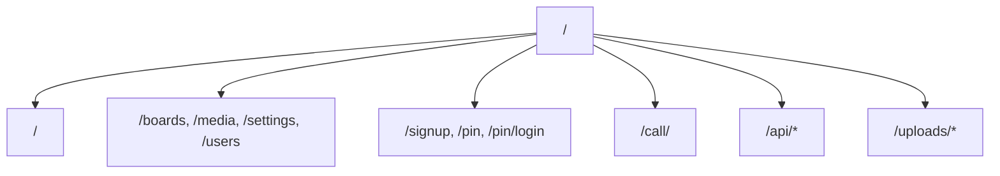
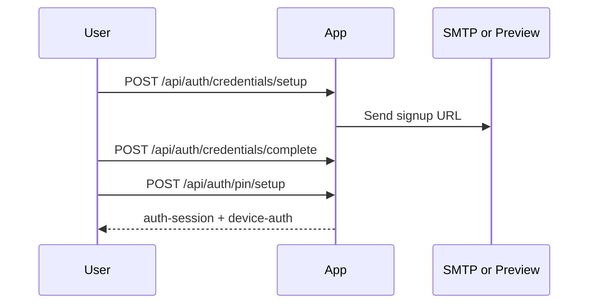
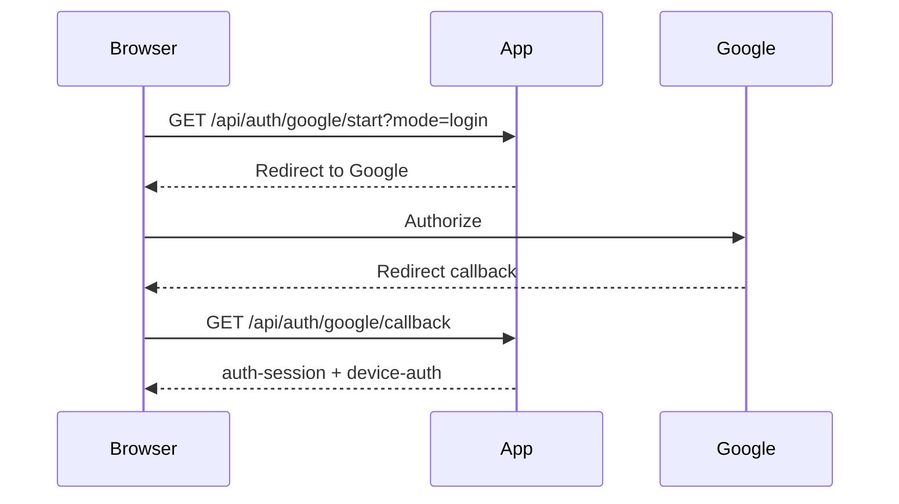
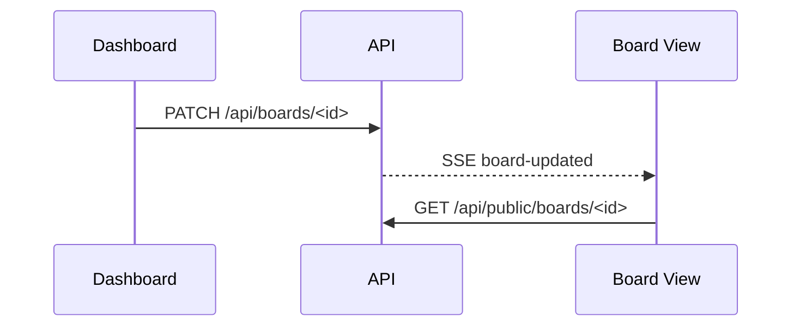

# Keinage Routing Reference

最終更新: 2026-04-30

## 1. このドキュメントの目的

このドキュメントは Keinage の画面ルートと API Route Handler を一覧できるようにまとめます。詳細な利用者向け仕様は [SPEC.md](./SPEC.md)、内部設計は [DESIGN.md](./DESIGN.md) を参照してください。

## 2. ルーティング全体

## 3. 画面ルート

### 3.1 公開・表示画面

| Path | 内容 | 認証 |
| --- | --- | --- |
| `/` | 初期導線。状態に応じてボード/ダッシュボード/認証へ誘導 | 状況による |
| `/<boardId>` | 公開ボード表示 | 不要 |
| `/call/<boardId>` | 呼び出し番号テンプレート用の操作画面 | ボードの call passcode |

### 3.2 ダッシュボード

| Path | 内容 | 認証 |
| --- | --- | --- |
| `/boards` | ボード一覧 | 必要 |
| `/boards/new` | ボード作成 | 必要 |
| `/boards/<boardId>` | ボード編集 | 必要 |
| `/media` | アップロード済みメディア管理 | `admin` |
| `/settings` | ユーザー設定・管理設定 | 必要 |
| `/users` | Shared user 管理 | `admin` |
| `/delete-account` | Owner アカウント削除リクエスト | Owner / `admin` |

### 3.3 認証・登録

| Path | 内容 | 認証 |
| --- | --- | --- |
| `/signup` | Owner 登録開始 | 不要 |
| `/signingup` | Owner 登録 URL の送達待ち | `signup-request-id` Cookie |
| `/signup/<token>` | Owner パスワード設定 | 登録 token |
| `/signup/shared?token=<token>` | Shared user 登録 | 招待 token |
| `/pin/setup` | 初期 PIN 設定 | 一時セットアップセッション |
| `/pin` | PIN ログイン | `device-auth` Cookie |
| `/pin/login` | フル認証ログイン | 不要 |
| `/pin/forgot` | PIN リセット依頼 | 不要 |
| `/pin/reset/<token>` | PIN リセット | リセット token |
| `/deleting-account/<token>` | アカウント削除確定 | 削除 token |
| `/deleted-account` | アカウント削除完了 | 不要 |

## 4. Cookie

| Cookie | 用途 |
| --- | --- |
| `auth-session` | 認証済みセッション |
| `device-auth` | 端末単位のフル認証履歴 |
| `signup-request-id` | `/signingup` 用の Owner 仮登録識別 |
| `google-oauth-state` | Google OAuth/OIDC callback の state 検証 |

`NODE_ENV=production` では認証系 Cookie に `Secure` 属性が付きます。ローカル開発では HTTP 動作のため `Secure` を付与しません。

## 5. 認証 API

### 5.1 Owner / Shared 登録

| Method | Path | 内容 | 認証 |
| --- | --- | --- | --- |
| `POST` | `/api/auth/credentials/setup` | Owner 仮登録を作成し、登録 URL を発行 | 不要 |
| `POST` | `/api/auth/credentials/setup/resend` | Owner 登録 URL を再送・再発行 | `signup-request-id` Cookie |
| `POST` | `/api/auth/credentials/complete` | Owner のパスワード登録を完了 | 登録 token |
| `POST` | `/api/auth/credentials/shared/complete` | Shared user のパスワード登録を完了 | 招待 token |
| `GET` | `/api/auth/google/start` | Google OAuth/OIDC を開始して Google へ redirect | 不要 |
| `POST` | `/api/auth/google/start` | Google OAuth/OIDC 認可 URL を JSON で返す | 不要 |
| `GET` | `/api/auth/google/callback` | Google callback を処理し、登録またはログインを完了 | state Cookie |
| `POST` | `/api/auth/pin/setup` | 初期 PIN を設定 | 一時セットアップセッション |

`GET /api/auth/google/start` は `mode=login|owner-signup|shared-signup`、`redirectTo`、`token` を受け付けます。Google OAuth/OIDC は Authorization Code + PKCE、nonce、opaque state、JWKS 署名検証を使います。

### 5.2 ログイン・ログアウト

| Method | Path | 内容 | 認証 |
| --- | --- | --- | --- |
| `POST` | `/api/auth/credentials/login` | メールアドレスまたはユーザーID + パスワードでログイン | 不要 |
| `POST` | `/api/auth/pin/verify` | PIN ログイン | `device-auth` Cookie |
| `POST` | `/api/auth/pin/logout` | 現在のセッションを削除 | 任意 |
| `GET` | `/api/auth/pin/status` | PIN ログイン対象ユーザーと期限情報を取得 | 任意 |

`POST /api/auth/credentials/login` と `POST /api/auth/pin/verify` は失敗回数制限を行います。`TRUST_PROXY_HEADERS=true` のときだけ `x-forwarded-for` / `x-real-ip` を client IP として信用します。

### 5.3 アカウント設定

| Method | Path | 内容 | 認証 |
| --- | --- | --- | --- |
| `PATCH` | `/api/auth/password/change` | パスワード変更 | 必要 |
| `PATCH` | `/api/auth/pin/change` | PIN 変更 | 必要 |
| `POST` | `/api/auth/pin/forgot` | PIN リセット URL を送信 | 不要 |
| `POST` | `/api/auth/pin/reset` | PIN リセット token で PIN を更新 | リセット token |
| `POST` | `/api/auth/account-deletion/request` | Owner アカウント削除 URL を送信 | Owner / `admin` |
| `POST` | `/api/auth/account-deletion/complete` | Owner アカウント削除を確定 | 削除 token |
| `PATCH` | `/api/users/me` | 自分の表示テーマ・locale を更新 | 必要 |

## 6. ボード API

| Method | Path | 内容 | 認証 |
| --- | --- | --- | --- |
| `GET` | `/api/boards` | 自分が編集できるボード一覧 | 必要 |
| `POST` | `/api/boards` | ボード作成 | 必要 |
| `GET` | `/api/boards/<id>` | ボード詳細 | 必要 |
| `PATCH` | `/api/boards/<id>` | ボード設定更新 | 必要 |
| `DELETE` | `/api/boards/<id>` | ボード削除 | 必要 |
| `GET` | `/api/public/boards/<id>` | 公開ボード詳細 | 不要 |

ボード更新・削除後は対象ボードへ SSE イベントが発行されます。

## 7. メディア API

| Method | Path | 内容 | 認証 |
| --- | --- | --- | --- |
| `GET` | `/api/media` | DB 登録済みメディア一覧 | 必要 |
| `POST` | `/api/media` | メディアアップロード | 必要 |
| `PATCH` | `/api/media` | メディア並び順・表示時間更新 | 必要 |
| `DELETE` | `/api/media` | DB 登録済みメディアを一括削除 | `admin` |
| `PATCH` | `/api/media/<id>` | 1 件の表示時間などを更新 | 必要 |
| `DELETE` | `/api/media/<id>` | 1 件削除 | 必要 |
| `GET` | `/api/media/files` | ストレージ上のアップロード済みファイル一覧 | `admin` |
| `DELETE` | `/api/media/files` | ストレージ上のファイル削除 | `admin` |
| `GET` | `/uploads/<path>` | アップロード済みファイル配信 | 不要 |

アップロード対応形式は画像 JPEG/PNG/WebP/GIF、動画 MP4/WebM です。最大ファイルサイズは 50 MB です。

## 8. メッセージ API

| Method | Path | 内容 | 認証 |
| --- | --- | --- | --- |
| `GET` | `/api/boards/<id>/messages` | ボードのメッセージ一覧 | 必要 |
| `DELETE` | `/api/boards/<id>/messages` | ボードのメッセージ一括削除 | 必要 |
| `GET` | `/api/public/boards/<id>/messages` | 公開表示用メッセージ一覧 | 不要 |
| `POST` | `/api/messages` | メッセージ作成 | 必要 |
| `PATCH` | `/api/messages/<id>` | メッセージ更新 | 必要 |
| `DELETE` | `/api/messages/<id>` | メッセージ削除 | 必要 |

メッセージ変更後は対象ボードへ SSE イベントが発行されます。

## 9. ユーザー API

| Method | Path | 内容 | 認証 |
| --- | --- | --- | --- |
| `GET` | `/api/users` | Owner 配下のユーザー一覧 | `admin` |
| `POST` | `/api/users` | Shared user 招待作成 | `admin` |
| `PATCH` | `/api/users/<id>` | Shared user のロールなどを更新 | `admin` |
| `DELETE` | `/api/users/<id>` | Shared user 削除 | `admin` |

Owner user は削除できません。

## 10. 設定・補助 API

| Method | Path | 内容 | 認証 |
| --- | --- | --- | --- |
| `GET` | `/api/settings` | Owner 設定取得 | `admin` |
| `PATCH` | `/api/settings` | Owner 設定更新 | `admin` |
| `GET` | `/api/weather` | 天気情報取得 | 不要 |
| `GET` | `/api/version` | 現在バージョンと最新リリース情報 | 不要 |
| `GET` | `/api/network` | ネットワーク情報取得 | 不要 |

`/api/weather` は外部天気 API の結果を一定時間キャッシュします。`/api/version` は GitHub Releases API を参照します。

## 11. SSE API

| Method | Path | 内容 | 認証 |
| --- | --- | --- | --- |
| `GET` | `/api/sse` | SSE 疎通用 endpoint | 不要 |
| `GET` | `/api/sse/<boardId>` | ボード単位の SSE stream | 不要 |

イベント名:

| Event | 発生契機 |
| --- | --- |
| `board-updated` | ボード更新・削除 |
| `media-updated` | メディア追加・並び替え・削除 |
| `message-updated` | メッセージ追加・更新・削除 |

## 12. 代表的なフロー

### 12.1 Owner 登録

### 12.2 Google ログイン

### 12.3 ボード更新

