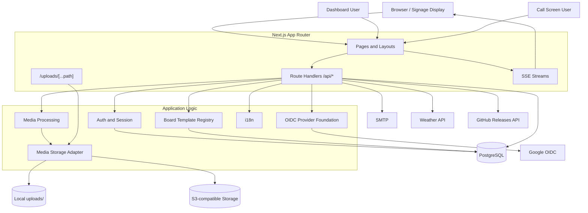
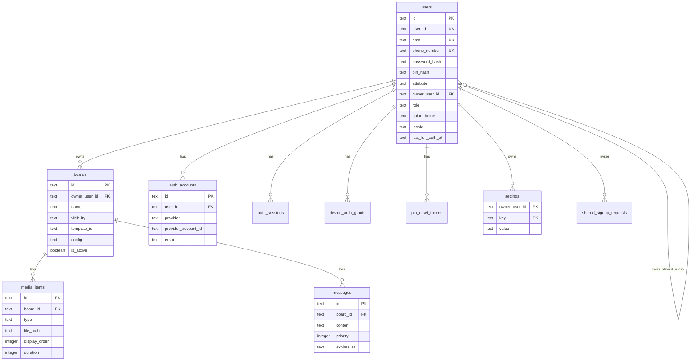
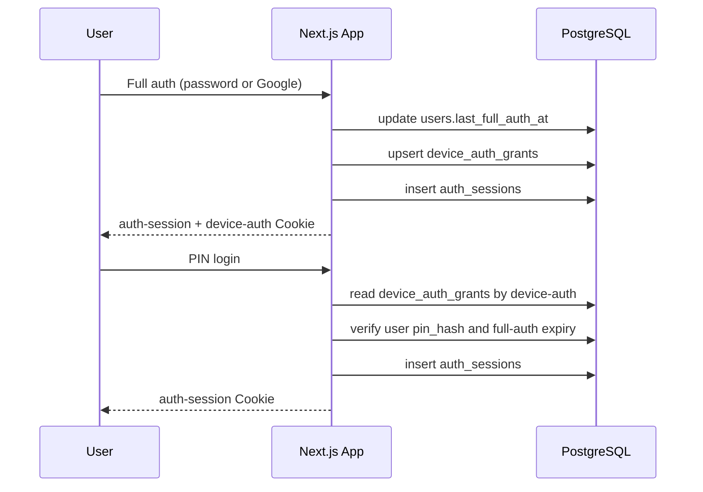
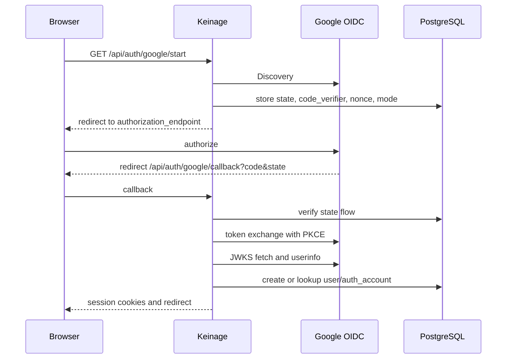
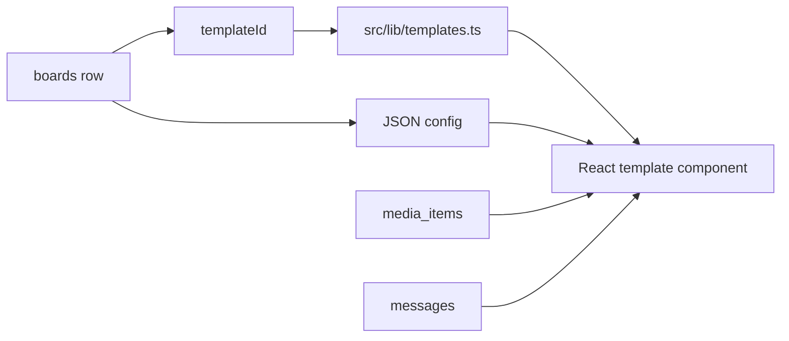
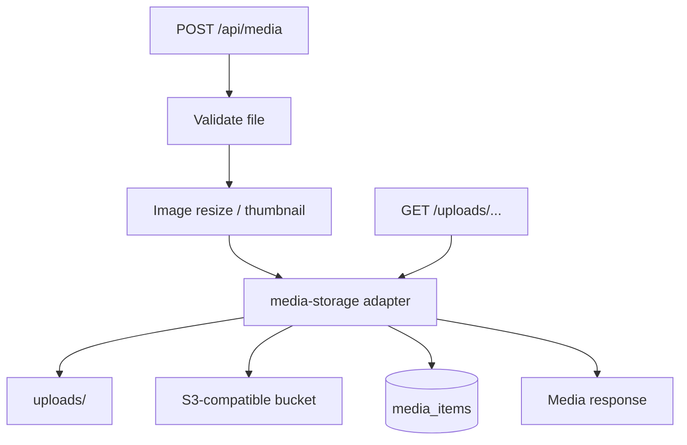

# Keinage Design

最終更新: 2026-04-30

## 1. このドキュメントの目的

このドキュメントは、Keinage のメンテナーおよび開発者向けに、全体設計、技術要素、Database schema、ディレクトリ構成、i18n、主要な実装判断をまとめます。ユーザー視点の仕様は [SPEC.md](./SPEC.md)、ルーティング一覧は [API.md](./API.md) を参照してください。

## 2. 全体アーキテクチャ

Keinage は Next.js App Router を中心に、表示画面、管理画面、Route Handler API を 1 つのアプリで提供します。



## 3. 技術要素

| 項目 | 採用技術 |
| --- | --- |
| Framework | Next.js 16 App Router |
| Language | TypeScript |
| UI | React 19, Tailwind CSS v4, shadcn/ui, Framer Motion |
| Icons | lucide-react |
| Database | PostgreSQL |
| ORM | Drizzle ORM |
| Media processing | sharp |
| Realtime | Server-Sent Events |
| Auth | App session Cookie, device auth Cookie, PIN, Google OAuth/OIDC |
| OIDC | Discovery, Authorization Code + PKCE, nonce, JWKS RS256 verification |
| Storage | Local filesystem or S3-compatible storage |
| Package manager | pnpm |
| Container | Docker standalone Next.js output |

## 4. ディレクトリ構成

| パス | 役割 |
| --- | --- |
| `src/app` | App Router。画面、Route Handler、アップロード配信 route を配置 |
| `src/app/(board)` | 公開ボード表示 |
| `src/app/(dashboard)` | 認証後の管理画面 |
| `src/app/api` | API Route Handler |
| `src/app/call` | 呼び出し番号テンプレート用の操作画面 |
| `src/app/uploads/[...path]` | ローカル/S3 上のアップロード済みファイルを配信 |
| `src/components/board` | ボード表示、テンプレート、表示用部品 |
| `src/components/dashboard` | 管理画面 UI |
| `src/components/auth` | 認証 UI |
| `src/components/i18n` | クライアント側 i18n provider |
| `src/db` | Drizzle schema と DB 接続 |
| `src/lib` | 認証、OIDC、SSE、メディア、設定、i18n などの共通ロジック |
| `src/types` | 共有型定義 |
| `drizzle` | SQL migration と snapshot |
| `docker` | Dockerfile、entrypoint、migration runner |
| `uploads` | ローカル保存時のメディア実体 |

## 5. Database Schema

### 5.1 ER 図



### 5.2 主要テーブル

| テーブル | 役割 |
| --- | --- |
| `users` | ログイン主体。Owner / Shared、ロール、表示設定、PIN、認証時刻を保持 |
| `auth_accounts` | 認証方式と外部アカウントの紐付け。`provider + providerAccountId` が一意 |
| `auth_sessions` | 24 時間のアプリセッション |
| `device_auth_grants` | 端末単位のフル認証履歴。PIN ログイン対象ユーザーを決める |
| `signup_requests` | Owner のメールアドレス + パスワード仮登録 |
| `shared_signup_requests` | Shared user 招待 |
| `google_oauth_flows` | Google OAuth/OIDC の state、PKCE verifier、nonce、mode、redirectTo |
| `pin_reset_tokens` | PIN リセット用トークン |
| `account_deletion_requests` | Owner アカウント削除用トークン |
| `boards` | ボード本体。テンプレート ID と JSON config を保持 |
| `media_items` | ボードに紐づく画像・動画 |
| `messages` | ボードに紐づくメッセージ |
| `settings` | Owner 単位の KV 設定 |
| `pin_attempts` | 認証失敗回数の記録 |

## 6. 認証設計

### 6.1 セッションモデル



Keinage は「フル認証」と「PIN による軽量再認証」を分けています。フル認証はメールアドレス + パスワードまたは Google OAuth/OIDC で行います。PIN ログインは `device-auth` に紐づくユーザーだけを対象にし、フル認証期限が切れていれば拒否します。

### 6.2 Google OAuth/OIDC



Google は `issuer=https://accounts.google.com` の OIDC Provider preset です。実装は `src/lib/oidc.ts` に集約し、次を provider 非依存にしています。

- Discovery (`/.well-known/openid-configuration`)
- 認可 URL 生成
- Authorization Code + PKCE token exchange
- ID token の issuer / audience / expiration / nonce 検証
- JWKS による RS256 署名検証
- userinfo 取得

Google 固有 route は後方互換のため `src/app/api/auth/google/*` に残します。環境変数名も `GOOGLE_OAUTH_*` を維持します。

## 7. ボードとテンプレート設計

テンプレートは registry 方式です。`boards.templateId` と `boards.config` で表示を決め、DB schema を増やさずにテンプレート固有設定を JSON として保持します。



テンプレート追加時は、表示コンポーネント、既定 config、必要な dashboard editor、i18n 文字列、registry 登録を追加します。

## 8. メディア保存と配信

`src/lib/media-storage.ts` がローカル保存と S3 互換ストレージを抽象化します。



- DB には `/uploads/<filename>` の公開パスを保存します。
- S3 未設定時は `uploads/` と `uploads/thumbs/` に保存します。
- S3 設定時は `S3_INTERNAL_ENDPOINT` を優先し、なければ `S3_ENDPOINT` を使います。
- 画像は `src/lib/image.ts` でリサイズとサムネイル生成を行います。
- standalone build 後の動的ファイル配信に対応するため、`/uploads/[...path]` route で保存先から読み出します。

## 9. リアルタイム更新

Keinage は WebSocket ではなく Server-Sent Events を使います。

```mermaid
flowchart LR
  mutation[API mutation] --> emit[emitSSE(boardId, event)]
  emit --> hub[src/lib/sse.ts in-memory clients]
  hub --> display[Board display]
  display --> refetch[Refetch board/media/messages]
```

SSE はプロセス内メモリで購読者を管理します。複数アプリインスタンス間のイベント共有は未対応です。

## 10. i18n

| ファイル | 役割 |
| --- | --- |
| `src/lib/i18n.ts` | 対応 locale、fallback、format helper |
| `src/lib/i18n-messages.ts` | UI 文字列 catalog |
| `src/lib/i18n-server.ts` | Server Component / Route Handler 側の request locale 解決 |
| `src/components/i18n/LocaleProvider.tsx` | Client Component 側の locale context |

Locale はユーザー設定、Cookie、`Accept-Language` の順に解決します。新しい表示文字列を追加する場合は、原則として `i18n-messages.ts` に全対応 locale 分を追加します。

## 11. 設定管理

設定は大きく 2 種類です。

| 種類 | 保存先 | 例 |
| --- | --- | --- |
| ユーザー設定 | `users` | `colorTheme`, `locale`, userId, email, PIN |
| Owner 設定 | `settings` | `weatherCityId`, `imageMaxLongEdge`, `authExpireDays` |

Owner 設定は KV 形式のため、DB migration を増やさずに設定項目を追加できます。型変換や既定値は `src/lib/owner-settings.ts` と各 Route Handler / UI で扱います。

## 12. 外部連携

| 連携先 | 用途 |
| --- | --- |
| Google OIDC | Google アカウントによる登録・ログイン |
| SMTP | 登録、招待、PIN リセット、アカウント削除 URL の送信 |
| weather.tsukumijima.net | 天気情報表示 |
| GitHub Releases API | 最新バージョン確認 |
| S3-compatible storage | メディア保存 |

## 13. Docker / デプロイ

Docker は multi-stage build です。

1. `deps`: pnpm 依存関係をインストール
2. `builder`: `pnpm build`
3. `runner`: standalone output と静的ファイルを実行

`docker/entrypoint.sh` は起動前に migration を実行してから `node server.js` を起動します。Docker Compose では PostgreSQL health check 後に app が起動します。

## 14. 開発時の注意

- Route Handler の認可境界は endpoint ごとに確認してください。
- 新しい UI 文字列は i18n catalog に追加してください。
- 新しいテンプレート設定は `boards.config` の後方互換を意識してください。
- OAuth redirect で `0.0.0.0` を使わず、ローカルでは `http://localhost:3000` を使ってください。
- SSE は単一プロセス前提です。水平スケール時は共有 pub/sub が必要です。
