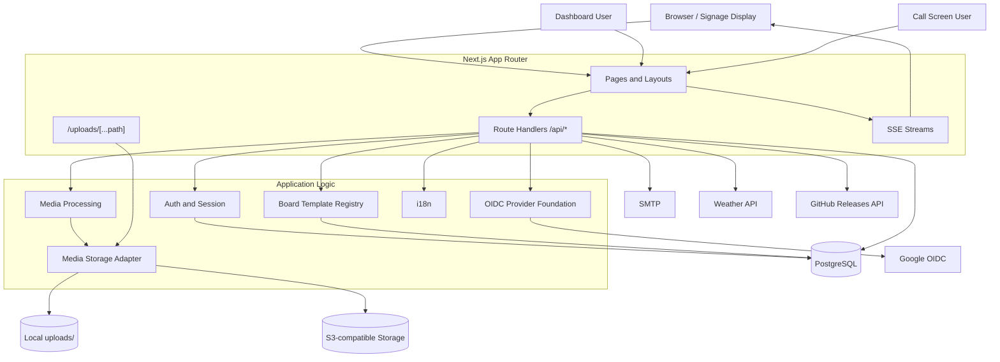
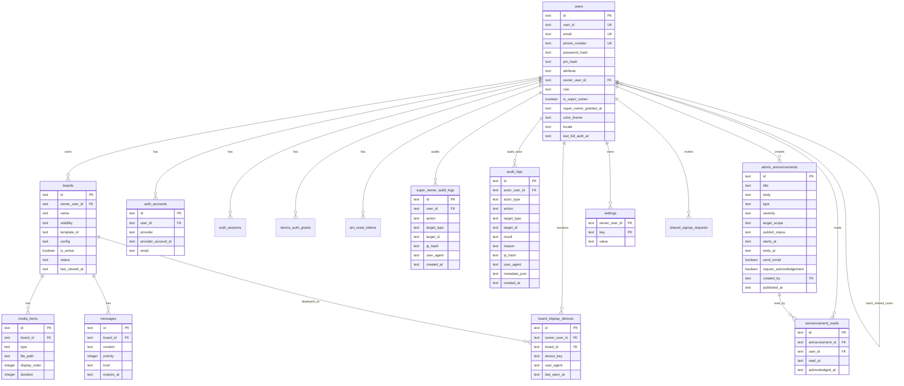
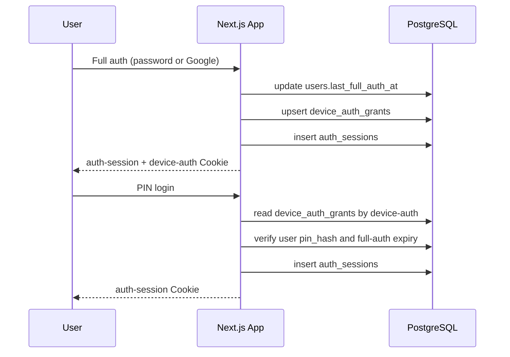
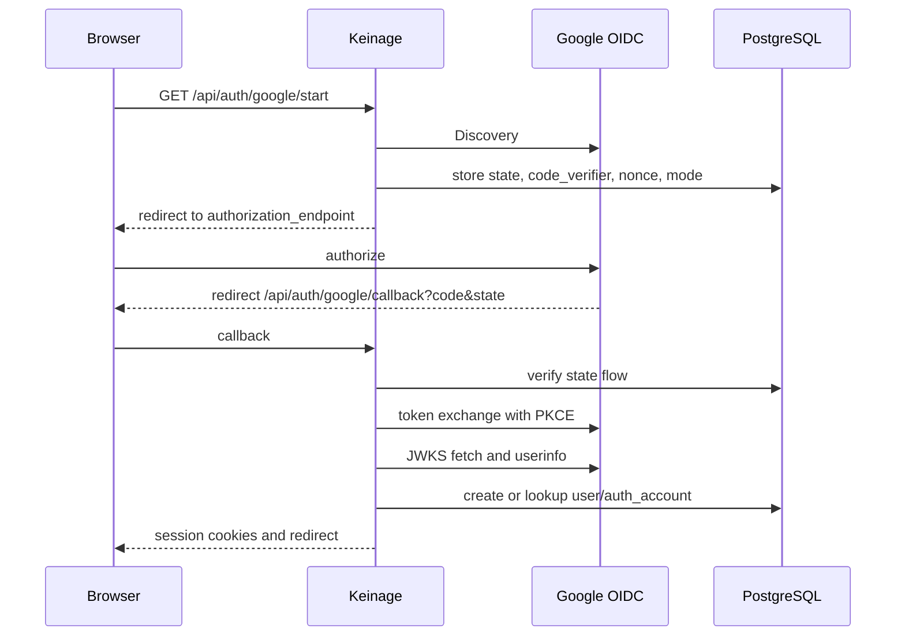
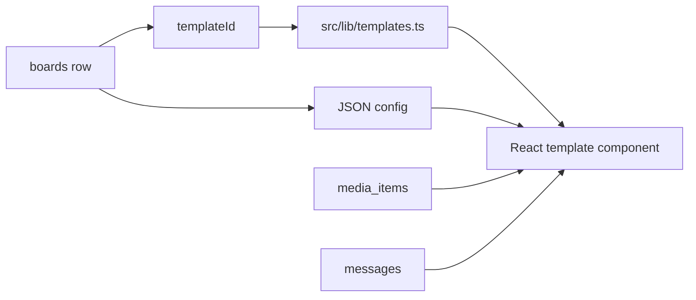
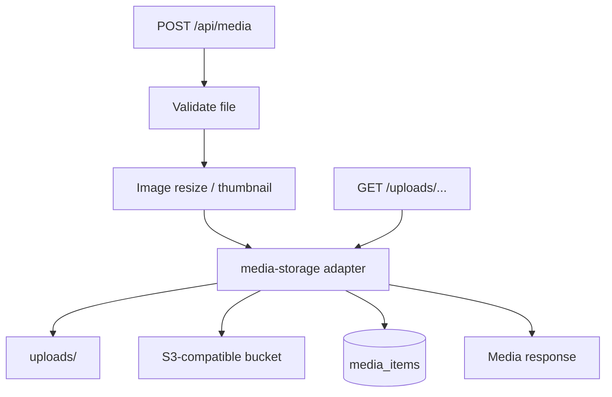
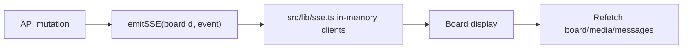

# Keinage Design

最終更新: 2026-05-03

## 1. このドキュメントの目的

このドキュメントは、Keinage のメンテナーおよび開発者向けに、全体設計、技術要素、Database schema、ディレクトリ構成、i18n、主要な実装判断をまとめます。ユーザー視点の仕様は [SPEC.md](./SPEC.md)、ルーティング一覧は [API.md](./API.md) を参照してください。

## 2. 全体アーキテクチャ

Keinage は Next.js App Router を中心に、表示画面、管理画面、Route Handler API を 1 つのアプリで提供します。

## 3. 技術要素

| 項目 | 採用技術 |
| --- | --- |
| Framework | Next.js 16 App Router |
| Language | TypeScript |
| UI | React 19, Tailwind CSS v4, shadcn/ui, Framer Motion |
| Icons | lucide-react |
| Database | PostgreSQL |
| ORM | Drizzle ORM |
| Media processing | sharp |
| Realtime | Server-Sent Events |
| Auth | App session Cookie, device auth Cookie, PIN, Google OAuth/OIDC, WebAuthn / Passkey |
| OIDC | Discovery, Authorization Code + PKCE, nonce, JWKS RS256 verification |
| Storage | Local filesystem or S3-compatible storage |
| Package manager | pnpm |
| Container | Docker standalone Next.js output |

## 4. ディレクトリ構成

| パス | 役割 |
| --- | --- |
| `src/app` | App Router。画面、Route Handler、アップロード配信 route を配置 |
| `src/app/(board)` | 公開ボード表示 |
| `src/app/(dashboard)` | 認証後の管理画面 |
| `src/app/api` | API Route Handler |
| `src/app/call` | 呼び出し番号テンプレート用の操作画面 |
| `src/app/uploads/[...path]` | ローカル/S3 上のアップロード済みファイルを配信 |
| `src/components/board` | ボード表示、テンプレート、表示用部品 |
| `src/components/dashboard` | 管理画面 UI |
| `src/components/auth` | 認証 UI |
| `src/components/i18n` | クライアント側 i18n provider |
| `src/db` | Drizzle schema と DB 接続 |
| `src/lib` | 認証、OIDC、SSE、メディア、設定、i18n などの共通ロジック |
| `src/types` | 共有型定義 |
| `drizzle` | SQL migration と snapshot |
| `docker` | Dockerfile、entrypoint、migration runner |
| `uploads` | ローカル保存時のメディア実体 |

## 5. Database Schema

### 5.1 ER 図

### 5.2 主要テーブル

| テーブル | 役割 |
| --- | --- |
| `users` | ログイン主体。Owner / Shared、ロール、Super Owner属性、表示設定、PIN、認証時刻を保持 |
| `auth_accounts` | 認証方式と外部アカウントの紐付け。`provider + providerAccountId` が一意 |
| `auth_sessions` | 24 時間のアプリセッション |
| `device_auth_grants` | 端末単位のフル認証履歴。PIN ログイン対象ユーザーを決める |
| `webauthn_credentials` | Owner の Passkey credential public key、counter、transports、最終使用日時 |
| `webauthn_challenges` | WebAuthn 登録・認証 challenge。有効期限と使用済み状態を保持 |
| `audit_logs` | 認証、課金、Webhook、退会、Super Owner操作などの横断監査ログ |
| `super_owner_audit_logs` | Super Owner付与、専用APIアクセス、専用操作の監査ログ |
| `admin_announcements` | Super Ownerが作成する運営通知。種別、重要度、対象プラン、公開期間、メール送信有無を保持 |
| `announcement_reads` | ユーザーごとの運営通知の既読・確認状態 |
| `signup_requests` | Owner のメールアドレス + パスワード仮登録 |
| `shared_signup_requests` | Shared user 招待 |
| `google_oauth_flows` | Google OAuth/OIDC の state、PKCE verifier、nonce、mode、redirectTo |
| `pin_reset_tokens` | PIN リセット用トークン |
| `account_deletion_requests` | Owner アカウント削除用トークン |
| `boards` | ボード本体。テンプレート ID と JSON config を保持 |
| `board_display_devices` | 表示端末 heartbeat。匿名 device key と表示中ボードの組み合わせごとに、User-Agent、最終アクセス時刻を保持 |
| `media_items` | ボードに紐づく画像・動画 |
| `messages` | ボードに紐づくメッセージ |
| `settings` | Owner 単位の KV 設定 |
| `pin_attempts` | 認証失敗回数と各種 rate limit bucket の記録 |

## 6. 認証設計

### 6.1 セッションモデル

Keinage は「フル認証」と「PIN による軽量再認証」を分けています。フル認証はメールアドレス + パスワードまたは Google OAuth/OIDC で行います。PIN ログインは `device-auth` に紐づくユーザーだけを対象にし、フル認証期限が切れていれば拒否します。

`WEBAUTHN_ENABLED=true` かつ `WEBAUTHN_OWNER_REQUIRED=true` の場合、Owner の新規 `auth_sessions` は `webauthn_verified=false` で作成されます。ダッシュボード layout と `getSessionUser()` は未検証セッションをブロックし、Passkey 登録または認証画面だけが `getSessionUserAllowingWebAuthnPending()` で一時的に通過します。

### 6.2 WebAuthn / Passkey

WebAuthn 処理は `src/lib/webauthn.ts` に集約し、RP ID / Origin は `WEBAUTHN_RP_ID`、`WEBAUTHN_ORIGIN`、`APP_PUBLIC_ORIGIN` から解決します。登録・認証の開始 API は challenge を `webauthn_challenges` に保存し、完了 API は client data の challenge と照合して一度だけ消費します。

Owner が Passkey 必須で、credential が未登録の場合は `/passkey/setup`、登録済みの場合は `/passkey/verify` へ誘導します。認証成功後は現在の `auth-session` の `webauthn_verified` を true に更新します。失敗試行は既存の `pin_attempts` bucket を再利用し、24 時間に 5 回までに制限します。

### 6.3 Google OAuth/OIDC

Google は `issuer=https://accounts.google.com` の OIDC Provider preset です。実装は `src/lib/oidc.ts` に集約し、次を provider 非依存にしています。

- Discovery (`/.well-known/openid-configuration`)
- 認可 URL 生成
- Authorization Code + PKCE token exchange
- ID token の issuer / audience / expiration / nonce 検証
- JWKS による RS256 署名検証
- userinfo 取得

Google 固有 route は後方互換のため `src/app/api/auth/google/*` に残します。環境変数名も `GOOGLE_OAUTH_*` を維持します。

### 6.4 Super Owner

Super Owner は公式SaaSの運営通知やメンテナンス通知など、通常Ownerより高い権限を必要とする運営者向けユーザーです。隠しURLや初期パスワードは使わず、通常のOwner登録・ログイン後に環境変数で指定されたメールアドレスと照合して初回bootstrapします。

bootstrap は `SUPER_OWNER_BOOTSTRAP_ENABLED=true`、`SUPER_OWNER_EMAIL` 設定済み、対象ユーザーが検証済みメールアドレスを持つOwner admin、かつ既存Super Ownerが存在しない場合だけ実行されます。`SUPER_OWNER_REQUIRE_GOOGLE=true` の場合は、現在の認証経路が Google OIDC のときだけ付与します。DBには `users.is_super_owner=true` の部分ユニークインデックスを置き、アプリ実装の競合や設定ミスがあっても2人目は作成されません。

Super Owner専用処理は `requireSuperOwner()` を通してサーバー側で必ず確認します。Super Owner付与と専用APIアクセスは `super_owner_audit_logs` に記録し、IPアドレスは直接保存せずハッシュ化します。

### 6.5 運営通知

Super Owner は `/announcements` から公式SaaSまたはSelf-hosted内の運営通知を作成できます。通知は `draft`、`published`、`archived` の状態を持ち、通常ユーザーには `published` かつ `starts_at` / `ends_at` の公開期間内で、対象プランに一致するものだけを返します。対象プラン判定はクライアントに任せず、サーバー側でユーザーの effective plan から解決します。

未読の `high` / `critical` 通知は管理画面上部にバナー表示します。`require_acknowledgement=true` の通知は、確認済みになるまで管理画面右下にも固定表示します。既読・確認状態は `announcement_reads` に保存します。`send_email=true` の通知は公開時に既存SMTP設定で対象ユーザーへ送信を試行します。メール送信に失敗しても通知公開は取り消さず、失敗件数を通知レコードとSuper Owner監査ログに残します。

### 6.6 監査ログ

`audit_logs` は `src/lib/audit-log.ts` の `writeAuditLog()` / `writeUserAuditLog()` 経由でのみ書き込みます。ログ書き込みに失敗してもユーザー操作は原則止めず、`serverLog()` でターミナルへ構造化エラーを出します。

IPアドレスは生値を保存せず、`AUDIT_LOG_IP_HASH_SECRET` が設定されている場合は HMAC-SHA256、未設定時も固定salt付き SHA-256 でハッシュ化します。`metadata_json` は最小限の情報に留め、password、token、secret、signature、cookie、credential、challenge などのキーはターミナルログとDB保存前に redaction します。

`AUDIT_LOG_ENABLED=false` の場合、DB保存は無効化されますが、重要イベントのターミナルログは維持されます。Super Owner は `/api/super-owner/audit-logs` で直近ログを確認できます。

## 7. ボードとテンプレート設計

テンプレートは registry 方式です。`boards.templateId` と `boards.config` で表示を決め、DB schema を増やさずにテンプレート固有設定を JSON として保持します。

テンプレート追加時は、表示コンポーネント、既定 config、必要な dashboard editor、i18n 文字列、registry 登録を追加します。

標準テンプレートは `simple`、`photo-clock`、`retro`、`message`、`call-number` の5種類です。拡張テンプレートは `clinic-hours`、`restaurant-menu`、`qr-info` で、`PlanLimits.extendedTemplates` によって Free では作成・変更を制限します。`restaurant-menu` の料理画像は `PlanLimits.menuItemImages` と公開ボード payload の `boardPlan.menuItemImages` で表示可否を制御します。

`simple` / `photo-clock` のスケジュール設定は `boards.config` に保持します。主なキーは `mediaSchedules`、`messageSchedules`、`fallbackMediaId` です。表示判定は `src/lib/scheduling.ts` に集約し、表示端末のブラウザが持つローカルタイムゾーンの `Date` で評価します。

プラン制限は `PlanLimits.scheduling` で表現します。管理 API は保存時に `sanitizeSchedulingConfig` を通し、Free ではスケジュール設定を保存せず、Lite では日付期間を除外します。公開ボード API は `boardPlan.scheduling` を返し、表示コンポーネント側でもプランに応じて判定します。

ボードのプラン適用状態は `boards.status` で管理します。`active` はプラン上有効、`inactive_due_to_plan` はダウングレード適用により表示対象外になった状態です。従来の `is_active` はユーザー操作による表示オン/オフとして残します。表示ページと公開ボード API は、表示成功時に `boards.last_viewed_at` を一定間隔で更新し、ダウングレード予約時の自動候補選択に使います。

Stripe のダウングレード予約またはキャンセル予約を検知した場合、Webhook payload だけで確定せず Stripe API から Subscription / Subscription Schedule を再取得します。`owner_subscriptions.current_price_id`、`current_period_end`、`cancel_at`、`stripe_schedule_id`、`pending_plan_code`、`pending_price_id`、`pending_billing_interval`、`pending_plan_effective_at`、`pending_active_board_ids` を保存します。`pending_active_board_ids` は `last_viewed_at`、`updated_at`、`created_at` の降順で、移行先プランの `PlanLimits.boards` 件まで自動生成します。実際の切替時は pending 候補だけを `active` とし、それ以外を `inactive_due_to_plan` にします。pending 候補が空または不正な場合も同じ順序で再選択します。

ダウングレード影響の表示は `src/lib/plan-impact.ts` に集約します。`OwnerUsage` と対象 `PlanDefinition` を比較し、ボード数、画像数、ストレージ、動画可否、動画解像度、1ファイル上限の超過候補を `PlanImpact` として返します。Billing 画面は予約中プランの影響警告、現在プランの over-limit 解消案内、プラン比較カードの事前警告に同じ判定を使います。

## 8. メディア保存と配信

`src/lib/media-storage.ts` がローカル保存と S3 互換ストレージを抽象化します。

`media_items.file_size_bytes` と `thumbnail_size_bytes` は Owner のストレージ使用量計算に使います。`media_items.width` / `height` はアップロード時に取得した画像・動画寸法で、ダウングレード後の動画再生可否判定に使います。既存メディアは自動削除・自動リサイズせず、現在プランの `storageBytes`、`images`、`videoEnabled`、`maxResolution` を超える場合は、新規アップロードや表示時の動画再生を制限します。

- DB には `/uploads/<filename>` の公開パスを保存します。
- 新規アップロードの object key は `owners/<owner>/boards/<board>/media/<mediaId>.<ext>` とし、Owner / board scope を key に含めます。サムネイルは同じ scope の `media/thumbs/` に保存します。既存の flat key も引き続き読み出せます。
- S3 未設定時は `uploads/` に保存します。S3 利用時は `S3_REGION` と `S3_BUCKET` が必須です。`S3_INTERNAL_ENDPOINT` / `S3_ENDPOINT` は任意で、AWS S3 では省略できます。`S3_ACCESS_KEY_ID` と `S3_SECRET_ACCESS_KEY` は両方ある場合のみ明示 credentials として使い、空の場合は AWS SDK の default credential provider chain に任せます。
- `STORAGE_DELIVERY_MODE=cloudfront-signed-url` の場合、board に返す media URL は `/uploads/<mediaId>` 形式にし、`/uploads/[...path]` route で board の公開設定と Owner scope を確認してから CloudFront Signed URL へ 302 redirect します。署名生成には `STORAGE_CDN_BASE_URL`、`CLOUDFRONT_KEY_PAIR_ID`、`CLOUDFRONT_PRIVATE_KEY` を使い、有効期限は `CLOUDFRONT_SIGNED_URL_EXPIRES_SECONDS` で調整できます。
- 署名付き配信を使わない場合は、`S3_PUBLIC_BASE_URL`、`STORAGE_PUBLIC_BASE_URL`、`CLOUDFRONT_BASE_URL` の順で公開 base URL を参照し、設定されている場合は public board の media URL に使います。private board は `/uploads/[...path]` route を維持し、認可と `private, no-store` cache-control を適用します。
- 画像は `src/lib/image.ts` でリサイズとサムネイル生成を行います。
- standalone build 後の動的ファイル配信に対応するため、`/uploads/[...path]` route で保存先から読み出します。動画のシークと終端ループを安定させるため、ローカル保存と S3 保存のどちらでも `Range` リクエストへ `206 Partial Content` で応答します。

## 9. リアルタイム更新

Keinage は WebSocket ではなく Server-Sent Events を使います。

SSE はプロセス内メモリで購読者を管理します。複数アプリインスタンス間のイベント共有は未対応です。

## 10. i18n

| ファイル | 役割 |
| --- | --- |
| `src/lib/i18n.ts` | 対応 locale、fallback、format helper |
| `src/lib/i18n-messages.ts` | UI 文字列 catalog |
| `src/lib/i18n-server.ts` | Server Component / Route Handler 側の request locale 解決 |
| `src/components/i18n/LocaleProvider.tsx` | Client Component 側の locale context |

Locale はユーザー設定、Cookie、`Accept-Language` の順に解決します。新しい表示文字列を追加する場合は、原則として `i18n-messages.ts` に全対応 locale 分を追加します。

## 11. 設定管理

設定は大きく 2 種類です。

| 種類 | 保存先 | 例 |
| --- | --- | --- |
| ユーザー設定 | `users` | `colorTheme`, `locale`, userId, email, PIN |
| Owner 設定 | `settings` | `weatherCityId`, `imageMaxLongEdge`, `authExpireDays` |

Owner 設定は KV 形式のため、DB migration を増やさずに設定項目を追加できます。型変換や既定値は `src/lib/owner-settings.ts` と各 Route Handler / UI で扱います。

## 12. 外部連携

| 連携先 | 用途 |
| --- | --- |
| Google OIDC | Google アカウントによる登録・ログイン |
| SMTP | 登録、招待、PIN リセット、アカウント削除 URL の送信 |
| weather.tsukumijima.net | 天気情報表示 |
| GitHub Releases API | 最新バージョン確認 |
| S3-compatible storage | メディア保存 |

## 13. Docker / デプロイ

Docker は multi-stage build です。

1. `deps`: pnpm 依存関係をインストール
2. `builder`: `pnpm build`
3. `runner`: standalone output と静的ファイルを実行

`docker/entrypoint.sh` は起動前に migration を実行してから `node server.js` を起動します。Docker Compose では PostgreSQL health check 後に app が起動します。

## 14. 開発時の注意

- Route Handler の認可境界は endpoint ごとに確認してください。
- 新しい UI 文字列は i18n catalog に追加してください。
- 新しいテンプレート設定は `boards.config` の後方互換を意識してください。
- OAuth redirect で `0.0.0.0` を使わず、ローカルでは `http://localhost:3000` を使ってください。
- SSE は単一プロセス前提です。水平スケール時は共有 pub/sub が必要です。
